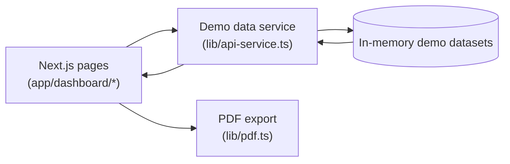

# Education ERP

A frontend ERP demo for educational institutions, built with **Next.js 15 + TypeScript**. It centralizes admissions, fees, staff, inventory, accounts, and reporting workflows into a single dashboard, backed by a typed in-repo demo data layer (`lib/api-service.ts`) so every module is explorable without a live backend.

> Portfolio note: this repository contains the frontend application and its demo data service only. There is no backend, database, or deployment configuration in this repo.

## Overview

**What it is:** an Education ERP (Enterprise Resource Planning) web app — a modular dashboard where each operational area (enrollment, fees, staff, operations, accounts, reports, settings) is a self-contained section under `/dashboard`.

**What problem it solves:** educational institutions typically juggle admissions, fee collection, staff records, inventory, purchase orders, and statements of account across disconnected spreadsheets and paper records. This project brings those workflows into one consistent UI with shared tables, filters, dialogs, search, and PDF/report exports.

**Who it is designed for:** administrators and office staff of schools, colleges, coaching institutes, and franchise-run education networks who need day-to-day operational screens (enquiries to admissions to fees to receipts, staff attendance, stock and purchase orders, account statements).

**Main purpose:** centralize institutional operations — one sidebar, one design system, one data-service pattern — so records move cleanly from enquiry to admission to fee collection to reporting.

## Key Features

Verified against the source in `app/dashboard/*`, `components/*`, and `lib/*`:

- **Dashboard & Analytics** — metric cards for enquiries, admissions, transfers, fee collection, and shortage data, plus Recharts visualizations (enquiry/admission distribution, enrollment trends, fee collection) and fee-structure summaries (`app/dashboard/page.tsx`, `getDashboardData`).
- **Admission Management** — enquiry capture and listing, LSQ (third-party/online) enquiries, admission records with batch/course/status, transfer-stage handling, and DTP session views (`app/dashboard/enrollment/*`, `getEnquiries`, `getLSQEnquiries`, `getAdmissions`, `getTransfers`, `getDTPSessions`, plus `getDemoEnquiries` / `getDemoAdmissions` demo variants).
- **Student Management** — student lookup by student ID and per-student detail shapes (`getDemoStudentByStudentId`, `DemoStudent`).
- **Admission Status Tracking** — admission status views and a graduation name-change request workflow with approve/reject status transitions (`app/dashboard/enrollment/admission-status`, `graduation-name-change`, `getDemoNameChangeRequests`, `setDemoNameChangeRequestStatus`).
- **Fee & Deposit Management** — fee structure setup, deposit entry and deposit-status tracking, discount types, amount conversion, payment details, and fund transfers between accounts (`app/dashboard/fee/*`, `getDemoDeposits`, `createDemoDeposit`, `getDemoFundAccounts`, `getDemoFundTransfers`, `createDemoFundTransfer`).

- **Staff Management** — staff listing with search and tabs, add/edit/view/delete dialogs, and PDF export of the staff list (`app/dashboard/staff/details`, `getDemoStaff`, `createDemoStaff`, `updateDemoStaff`, `deleteDemoStaff`, `lib/pdf.ts` via `exportStaffToPDF`).
- **Staff Attendance** — date/search/status-filtered attendance table with a mark-present action and PDF export (`app/dashboard/staff/attendance`, `getDemoAttendance`, `markDemoAttendancePresent`).
- **Teaching Subject Management** — subject allocations per staff member (staff, course, batch, semester) with full CRUD dialogs (`app/dashboard/staff/teaching-subject`, `getDemoTeachingSubjects`, `createDemoTeachingSubject`, `updateDemoTeachingSubject`, `deleteDemoTeachingSubject`).
- **Staff Assessment** — assessment listing with rating tabs and filters plus a per-assessment detail view (`app/dashboard/staff/assessment`, `getStaffAssessments`, `getStaffAssessmentById`).
- **Accounts & Statements** — Statement of Account (SOA) summary table and per-student SOA details (fee structure, payment history, pending installments) with print/download affordances (`app/dashboard/account/soa-summary`, `soa-details`, `getSOASummary`, `getSOADetails`).
- **Purchase Order Management** — purchase orders with vendor, items, and status plus full CRUD, backed by the demo service (`app/dashboard/operation/purchase-order`, `app/dashboard/enrollment/inventory`, `getDemoPurchaseOrders`, `createDemoPurchaseOrder`, `updateDemoPurchaseOrder`, `deleteDemoPurchaseOrder`).
- **Inventory Management** — inventory items and supplier records with create/update flows (`getDemoInventoryItems`, `createDemoInventoryItem`, `getDemoSuppliers`, `createDemoSupplier`, `updateDemoSupplier`).
- **Exchange Orders** — item/size exchange requests with an approve/complete/reject lifecycle (`app/dashboard/operation/exchange-order`, `getDemoExchangeOrders`, `createDemoExchangeOrder`, `updateDemoExchangeOrder`, `deleteDemoExchangeOrder`).
- **Static Data & Academic Setup** — configurable categories/items plus course, department, and subject CRUD used by academic tooling (`app/dashboard/operation/static-data`, `app/dashboard/tools/academic`, `getStaticDataCategories`, `getDemoCourses`, `getDemoDepartments`, `getDemoSubjects` and their create/update/delete variants).
- **Reports & Analytics** — enquiry, admission, fee-card, and LSQ enquiry detail reports with search, date filters, tabs, and export/print actions (`app/dashboard/reports/*`, `getAdmissionDetailsReport`, `getFeeCardDetails`); shortage and damage reporting with downloadable report views (`app/dashboard/shortage/*`).
- **Fee Calculator & Calendar Tools** — course fee calculator with scholarship, hostel, and transport options plus a comparison view, and an academic calendar with event management (`app/dashboard/tools/fee-calculator`, `tools/calendar`).
- **Franchise Workflows** — franchise holder/type/profile screens, invoice details and download, and a receipt dashboard (`app/dashboard/franchise/*`, `getFranchiseHolders`, `getFranchiseInvoices`).
- **User & Access Management** — user management table with role/status dialogs and an access-level matrix for role permissions (`app/dashboard/users`, `app/dashboard/settings/access`); profile page with photo upload and preferences (`app/dashboard/profile`, `getDemoProfile`, `updateDemoProfile`, `uploadDemoProfilePhoto`).
- **Centralized Data Management** — every module reads and writes through one typed service (`lib/api-service.ts`): legacy `{ success, data }` mock functions plus a `Demo*` typed layer (`DemoEnquiry`, `DemoAdmission`, `DemoStaff`, `DemoDeposit`, `DemoPurchaseOrder`, `DemoInventoryItem`, and more) returning promises with simulated latency.
- **Consistent UX Shell** — collapsible sidebar navigation with search, header with notifications and user menu, theme provider, toast notifications, and skeleton loading states for every section (`components/main-sidebar.tsx`, `main-header.tsx`, `theme-provider.tsx`, `hooks/use-toast.ts`, `*/loading.tsx`).


## Modules

Routes and purposes taken directly from the sidebar (`components/main-sidebar.tsx`) and the `app/dashboard/*` directories:

| Module | Route prefix | Purpose |
| --- | --- | --- |
| Dashboard | `/dashboard` | Metrics, charts, fee-structure summary |
| Enrollment | `/dashboard/enrollment` | Enquiry, LSQ enquiry, admission, transfer stage, DTP view, name-change confirmation, inventory/purchase order, admission status |
| Staff Assessment | `/dashboard/staff` | Staff attendance, staff details, teaching-subject allocation, staff assessments |
| Operation | `/dashboard/operation` | Exchange orders, purchase orders, static data |
| Account Statement | `/dashboard/account` | SOA summary, SOA details |
| Fee Collection | `/dashboard/fee` | Deposit amount/status, fund transfer, payment detail, fee structure, discount type, amount conversion |
| Franchise | `/dashboard/franchise` | Holders, types, profiles, invoices, receipts |
| Reports | `/dashboard/reports` | Enquiry, admission, fee-card, and LSQ enquiry detail reports |
| Shortage | `/dashboard/shortage` | Shortage reports, damage reports, downloadable reports |
| Tools | `/dashboard/tools` | Academic setup, calendar, fee calculator |
| Users | `/dashboard/users` | User management table and dialogs |
| Settings | `/dashboard/settings` | System settings, access-level permissions |
| Profile | `/dashboard/profile` | User profile, photo, preferences |
| Administration | `/dashboard/administration` | Administration section |
| Auth | `/login`, `/signup` | Demo login screen, signup form |

## Technology Stack

Verified against `package.json` (and confirmed absent where noted):

| Layer | Technology | Evidence |
| --- | --- | --- |
| Framework | Next.js 15 (App Router, `^15.2.4`) | `package.json`, `app/layout.tsx`, route groups |
| Language | TypeScript 5 (strict) | `package.json`, `tsconfig.json` (`"strict": true`) |
| UI | React 19, Tailwind CSS 3.4, Radix UI primitives, shadcn-style `components/ui` | `package.json`, `components/ui/*`, `tailwind.config.ts` |
| Forms & validation | React Hook Form, Zod, `@hookform/resolvers` | `package.json` |
| Charts | Recharts (v3.x API) | `package.json`, `app/dashboard/page.tsx`, `components/ui/chart.tsx` |
| PDF export | jsPDF + jspdf-autotable | `package.json`, `lib/pdf.ts`, staff and attendance pages |
| Dates | date-fns, react-day-picker | `package.json`, `components/ui/calendar.tsx` |
| Icons | Lucide React | `package.json`, used across all pages |
| Theming | next-themes | `package.json`, `components/theme-provider.tsx` |
| Data layer | In-repo async demo service (`lib/api-service.ts`) | `lib/api-service.ts` (`Demo*` types plus CRUD functions) |
| HTTP client | axios and fetch (available; demo pages use the local service) | `package.json`, `app/signup/page.tsx` |

**Not in this repository** (do not assume when evaluating the project): FastAPI, PostgreSQL, or any other backend/database — no Python files, no SQL or migration files, and no Docker or backend-server config exist here. Install-time `package.json` entries such as `express`, `mongoose`, `jsonwebtoken`, and `bcrypt` have no wired-up server code in the app source. The signup form posts to an external URL, while login is a browser-only demo credential check (`app/login/page.tsx`).

## Architecture

- **Frontend** — Next.js App Router. Each ERP area is a route segment under `app/dashboard/*` with a co-located `page.tsx` (client components: tables, filters, dialogs) and `loading.tsx` (skeleton states). Shared shell: `app/dashboard/layout.tsx` renders `SidebarProvider` + `MainSidebar` + `MainHeader`. Shared primitives: `components/ui/*`, `components/theme-provider.tsx`, `hooks/use-toast.ts`.
- **Backend** — none in this repo. The app is fully navigable without one.
- **API communication** — pages import async functions from `@/lib/api-service`. Two generations coexist: legacy `{ success, data }` mocks (for example `getStaffAssessments`, `getSOASummary`) and the typed `Demo*` layer (for example `getDemoStaff(): Promise<DemoStaff[]>`) with simulated latency. The only outbound network call in app source is the signup form's `POST`; login validates demo credentials locally in the browser.
- **Database** — none in this repo; the demo service holds typed in-memory datasets per domain (enquiries, admissions, staff, attendance, inventory, purchase and exchange orders, deposits, fund accounts and transfers, courses, departments, subjects, profiles).
- **Authentication/authorization** — no real auth. Login is a client-side demo check with visible sample credentials; access-level and user screens are UI-level role matrices, not enforced guards.
- **Data flow** — UI event calls a `lib/api-service.ts` async function, which resolves from an in-memory demo dataset; React state updates and the tables, dialogs, and toasts re-render. PDF actions flow through `lib/pdf.ts` (jsPDF + autotable) directly from the loaded rows.



## Getting Started

Prerequisites: Node.js (v24 was used during development) and `pnpm` (a `pnpm-lock.yaml` is committed; `package-lock.json` is also present).

```bash
# install
pnpm install

# run locally
pnpm dev
# then open http://localhost:3000

# type-check
npx tsc --noEmit

# production build
pnpm build
pnpm start
```

Demo login is a browser-only check whose sample institute, email, and password are displayed on the login screen itself; a successful entry navigates to `/dashboard`.

## Project Structure

```text
app/
  page.tsx            # marketing and landing page
  login/              # demo login (client-side credential check)
  signup/             # signup form (posts to an external URL)
  dashboard/
    page.tsx          # metrics and Recharts analytics
    layout.tsx        # sidebar and header shell
    enrollment/       # enquiry, admission, transfers, DTP, inventory, status
    staff/            # attendance, details, teaching-subject, assessment
    fee/              # deposits, fund transfer, structure, discounts
    operation/        # exchange orders, purchase orders, static data
    account/          # SOA summary and details
    franchise/        # holders, invoices, receipts, profiles
    reports/          # enquiry, admission, fee-card, and LSQ reports
    shortage/         # shortage and damage reports
    tools/            # academic setup, calendar, fee calculator
    users/ settings/ profile/ administration/
components/
  main-sidebar.tsx    # module navigation (source of truth for modules)
  main-header.tsx     # header, notifications, user menu
  ui/                 # design-system primitives (button, table, dialog, chart, and more)
lib/
  api-service.ts      # centralized demo data layer (legacy plus Demo* APIs)
  pdf.ts              # staff-list PDF export (jsPDF and autotable)
  utils.ts            # cn() class helper
hooks/                # use-toast, use-mobile, use-media-query
```

## Notes and Limitations

- Demo data resets on reload; changes are not persisted to any database.
- There is no server-side authentication, authorization enforcement, or session handling — do not use the login pattern as-is in production.
- Report and export buttons render real UI and generate client-side PDFs where implemented, but some actions are toast confirmations over sample data.
- An external signup endpoint is referenced in `app/signup/page.tsx`; everything else runs locally.
